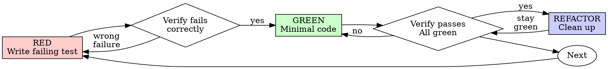

# Test-Driven Development (TDD)

## Overview

Write the test first. Watch it fail. Write minimal code to pass.

**Core principle:** If you didn't watch the test fail, you don't know if it tests the right thing.

**Violating the letter of the rules is violating the spirit of the rules.**

## When to Use

**Always:**
- New features
- Bug fixes
- Refactoring
- Behavior changes

**Exceptions (ask your human partner):**
- Throwaway prototypes
- Generated code
- Configuration files

Thinking "skip TDD just this once"? Stop. That's rationalization.

## The Iron Law

```
NO PRODUCTION CODE WITHOUT A FAILING TEST FIRST
```

Write code before the test? Delete it. Start over.

**No exceptions:**
- Don't keep it as "reference"
- Don't "adapt" it while writing tests
- Don't look at it
- Delete means delete

Implement fresh from tests. Period.

## Red-Green-Refactor



### RED - Write Failing Test

Write one minimal test showing what should happen.

<Good>
```rust
#[test]
fn detect_missing_return_type() {
    let db = Database::default();
    let src = r#" main(void) { return 0; } "#;
    let file = SourceFile::new(&db, "test.c".into(), src.into());

    let diags = parse::accumulated::<Diagnostics>(&db, file);

    assert_eq!(diags.len(), 1);
    assert_eq!(diags[0].message(), "Expected a return type for function");
    assert_eq!(diags[0].code(), codes::parse::missing_token);
}
```
Clear name, one behaviour, tests observable output (diagnostics) through the real pipeline; the seam is the input source.
</Good>

<Bad>
```rust
#[test]
fn test_parser() {
    let db = Database::default();
    let file = SourceFile::new(&db, "test.c".into(), "main(void) { return 0; }".into());
    let tree = parse_internal(&db, file);  // internal API

    assert_eq!(tree.root_node().child_count(), 5);  // implementation detail
    assert!(some_internal_cursor_moved());          // not user-visible behaviour
}
```
Vague name, tests implementation detail (tree shape, internal state) instead of observable behaviour (diagnostics). One test doing multiple things.
</Bad>

**Requirements:**
- One behaviour
- Clear name
- Assert on observable behaviour; prefer seams and dependency injection so you can test real code with controlled inputs (no mock frameworks)

### Verify RED - Watch It Fail

**MANDATORY. Never skip.**

```bash
cargo test detect_missing_return_type
```

(This repo uses `cargo nextest run -p mcc -- detect_missing_return_type` for the workspace.)

Confirm:
- Test fails (not errors)
- Failure message is expected
- Fails because feature missing (not typos)

**Test passes?** You're testing existing behavior. Fix test.

**Test errors?** Fix error, re-run until it fails correctly.

### GREEN - Minimal Code

Write simplest code to pass the test.

<Good>
```rust
// One query, one diagnostic when the pattern matches. No new types.
fn ensure_return_type(db: &dyn Db, lang: &Language, tree: &Tree, file: SourceFile) {
    let query = Query::new(lang, "(function_definition ...) @function-def").unwrap();
    let mut cursor = QueryCursor::new();
    for m in cursor.matches(&query, tree.root_node(), src.as_bytes()) {
        Diagnostic::error()
            .with_message("Expected a return type for function")
            .with_code(codes::parse::missing_token)
            .with_labels(vec![Label::primary(file, Span::for_node(m.captures[0].node))])
            .accumulate(db);
    }
}
```
Just enough to make the test pass; no config struct, no generic pipeline.
</Good>

<Bad>
```rust
// YAGNI: ParserConfig, validation pipeline, extra diagnostics you didn't test.
struct ParserConfig { strict_return_type: bool, emit_warnings: bool, ... }
fn parse_with_config(db: &dyn Db, file: SourceFile, config: &ParserConfig) -> Ast { ... }
```
Over-engineered: new types and options the test didn't ask for.
</Bad>

Don't add features, refactor other code, or "improve" beyond the test.

### Verify GREEN - Watch It Pass

**MANDATORY.**

```bash
cargo test detect_missing_return_type
```

Confirm:
- Test passes
- Other tests still pass
- Output pristine (no errors, warnings)

**Test fails?** Fix code, not test.

**Other tests fail?** Fix now.

### REFACTOR - Clean Up

After green only:
- Remove duplication
- Improve names
- Extract helpers

Keep tests green. Don't add behavior.

### Repeat

Next failing test for next feature.

## Good Tests

| Quality | Good | Bad |
|---------|------|-----|
| **Minimal** | One thing. "and" in name? Split it. | `fn test_validates_and_normalises_and_checks_domain()` |
| **Clear** | Name describes behaviour | `fn test_parser()` |
| **Shows intent** | Demonstrates desired API / observable outcome | Obscures what code should do |

## Why Order Matters

**"I'll write tests after to verify it works"**

Tests written after code pass immediately. Passing immediately proves nothing:
- Might test wrong thing
- Might test implementation, not behavior
- Might miss edge cases you forgot
- You never saw it catch the bug

Test-first forces you to see the test fail, proving it actually tests something.

**"I already manually tested all the edge cases"**

Manual testing is ad-hoc. You think you tested everything but:
- No record of what you tested
- Can't re-run when code changes
- Easy to forget cases under pressure
- "It worked when I tried it" ≠ comprehensive

Automated tests are systematic. They run the same way every time.

**"Deleting X hours of work is wasteful"**

Sunk cost fallacy. The time is already gone. Your choice now:
- Delete and rewrite with TDD (X more hours, high confidence)
- Keep it and add tests after (30 min, low confidence, likely bugs)

The "waste" is keeping code you can't trust. Working code without real tests is technical debt.

**"TDD is dogmatic, being pragmatic means adapting"**

TDD IS pragmatic:
- Finds bugs before commit (faster than debugging after)
- Prevents regressions (tests catch breaks immediately)
- Documents behavior (tests show how to use code)
- Enables refactoring (change freely, tests catch breaks)

"Pragmatic" shortcuts = debugging in production = slower.

**"Tests after achieve the same goals - it's spirit not ritual"**

No. Tests-after answer "What does this do?" Tests-first answer "What should this do?"

Tests-after are biased by your implementation. You test what you built, not what's required. You verify remembered edge cases, not discovered ones.

Tests-first force edge case discovery before implementing. Tests-after verify you remembered everything (you didn't).

30 minutes of tests after ≠ TDD. You get coverage, lose proof tests work.

## Common Rationalizations

| Excuse | Reality |
|--------|---------|
| "Too simple to test" | Simple code breaks. Test takes 30 seconds. |
| "I'll test after" | Tests passing immediately prove nothing. |
| "Tests after achieve same goals" | Tests-after = "what does this do?" Tests-first = "what should this do?" |
| "Already manually tested" | Ad-hoc ≠ systematic. No record, can't re-run. |
| "Deleting X hours is wasteful" | Sunk cost fallacy. Keeping unverified code is technical debt. |
| "Keep as reference, write tests first" | You'll adapt it. That's testing after. Delete means delete. |
| "Need to explore first" | Fine. Throw away exploration, start with TDD. |
| "Test hard = design unclear" | Listen to test. Hard to test = hard to use. |
| "TDD will slow me down" | TDD faster than debugging. Pragmatic = test-first. |
| "Manual test faster" | Manual doesn't prove edge cases. You'll re-test every change. |
| "Existing code has no tests" | You're improving it. Add tests for existing code. |

## Red Flags - STOP and Start Over

- Code before test
- Test after implementation
- Test passes immediately
- Can't explain why test failed
- Tests added "later"
- Rationalizing "just this once"
- "I already manually tested it"
- "Tests after achieve the same purpose"
- "It's about spirit not ritual"
- "Keep as reference" or "adapt existing code"
- "Already spent X hours, deleting is wasteful"
- "TDD is dogmatic, I'm being pragmatic"
- "This is different because..."

**All of these mean: Delete code. Start over with TDD.**

## Example: Bug Fix

**Bug:** Parser accepts a function without a return type; we should emit a diagnostic but don't.

**RED**
```rust
#[test]
fn detect_missing_return_type() {
    let db = Database::default();
    let file = SourceFile::new(&db, "test.c".into(), " main(void) { return 0; } ".into());
    let diags = parse::accumulated::<Diagnostics>(&db, file);
    assert_eq!(diags.len(), 1, "expected one diagnostic, got {}", diags.len());
    assert_eq!(diags[0].message(), "Expected a return type for function");
}
```

**Verify RED**
```bash
$ cargo test detect_missing_return_type
FAIL: assertion failed: expected one diagnostic, got 0
```

**GREEN**
Add the missing check: e.g. run a tree-sitter query for the pattern, emit the diagnostic when it matches (one branch in the parser, or a new `ensure_return_type` helper). No new config types — just enough to get the test green.

**Verify GREEN**
```bash
$ cargo test detect_missing_return_type
PASS
```

**REFACTOR**
Extract shared validation or diagnostic-building if duplication appears.

## Verification Checklist

Before marking work complete:

- [ ] Every new function/method has a test
- [ ] Watched each test fail before implementing
- [ ] Each test failed for expected reason (feature missing, not typo)
- [ ] Wrote minimal code to pass each test
- [ ] All tests pass
- [ ] Output pristine (no errors, warnings)
- [ ] Tests use real code (prefer seams and DI; test behaviour, not injected doubles' call counts)
- [ ] Edge cases and errors covered

Can't check all boxes? You skipped TDD. Start over.

## When Stuck

| Problem | Solution |
|---------|----------|
| Don't know how to test | Write wished-for API. Write assertion first. Ask your human partner. |
| Test too complicated | Design too complicated. Simplify interface. |
| Must mock everything | Code too coupled. Introduce a seam; inject the dependency so you can test real behaviour with controlled inputs or a test double. |
| Test setup huge | Extract helpers. Still complex? Simplify design. |

## Debugging Integration

Bug found? Write failing test reproducing it. Follow TDD cycle. Test proves fix and prevents regression.

Never fix bugs without a test.

## Testing Anti-Patterns

When adding test doubles or test utilities, read @testing-anti-patterns.md to avoid common pitfalls:
- Testing the double's behaviour (e.g. asserting on an injected dependency's call count) instead of the observable outcome
- Adding test-only methods to production types
- Injecting a dependency without designing for testability (no seam)

## Final Rule

```
Production code → test exists and failed first
Otherwise → not TDD
```

No exceptions without your human partner's permission.
